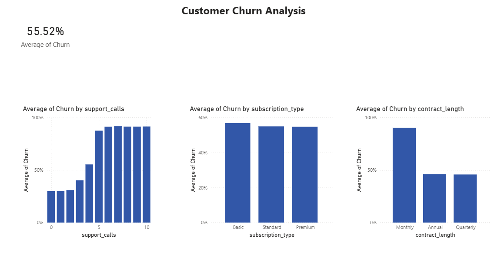
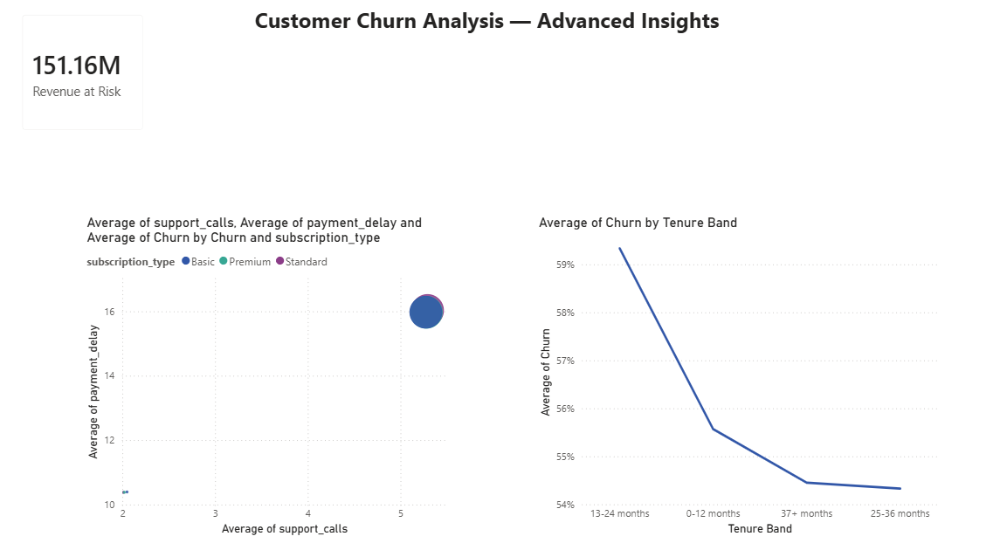

# 📉 Customer Churn Analysis
### End-to-End Data Analytics Project | SQL · BigQuery · Power BI

---

## 📌 Project Overview

This project analyzes **500,000+ customer records** to identify the key drivers of customer churn for a subscription-based business. The goal was to uncover actionable insights that help the business reduce churn, improve retention, and protect revenue.

**Tools Used:**
- **Google BigQuery** — data storage, cleaning, and SQL analysis
- **Power BI** — interactive dashboard and data visualization
- **SQL** — data profiling, segmentation, window functions, CTEs, and business KPIs

---

## 📂 Repository Structure

```
customer-churn-analysis/
│
├── sql/
│   └── customer_churn_bigquery.sql       # All SQL queries (8 sections)
│
├── dashboard/
│   ├── page1_core_insights.png           # Power BI dashboard - Page 1
│   └── page2_advanced_insights.png       # Power BI dashboard - Page 2
│
└── README.md
```

---

## 🗃️ Dataset

| Column | Description |
|---|---|
| CustomerID | Unique customer identifier |
| Age | Customer age |
| Gender | Male / Female |
| Tenure | Months as a customer |
| Usage Frequency | How often the product is used |
| Support Calls | Number of support contacts made |
| Payment Delay | Days payment was delayed |
| Subscription Type | Basic / Standard / Premium |
| Contract Length | Monthly / Quarterly / Annual |
| Total Spend | Lifetime spend in USD |
| Last Interaction | Days since last interaction |
| Churn | 1 = Churned, 0 = Retained |

---

## 🔍 SQL Analysis Structure

The SQL file is organized into 8 professional sections:

| Section | Focus |
|---|---|
| 1 | Data Quality & Profiling |
| 2 | Core Churn Metrics |
| 3 | Segmentation & Cohort Analysis |
| 4 | Window Functions (RANK, LAG, PERCENTILE) |
| 5 | CTE & Subquery Patterns |
| 6 | Business-Driven Revenue Metrics |
| 7 | Self-Joins & Correlation Analysis |
| 8 | Views & Parameterised Queries |

---

## 📊 Dashboard

### Page 1 — Core Insights


### Page 2 — Advanced Insights


---

## 💡 Key Business Insights

### 1. Overall Churn Rate is Critically High
> **55.52%** of all customers have churned — meaning more than half the customer base has been lost. This represents a significant business risk requiring immediate retention strategy.

---

### 2. Monthly Contracts Drive the Highest Churn
> Customers on **monthly contracts churn at nearly 100%**, compared to ~45% for annual and quarterly contracts. Customers on short-term contracts have no long-term commitment, making them far easier to lose. **Recommendation:** Incentivize customers to switch to annual contracts through discounts or loyalty rewards.

---

### 3. Support Calls are the Strongest Churn Predictor
> Churn rate increases steadily from **~20% at 0 support calls to nearly 100% at 10+ support calls**. Customers who repeatedly contact support are frustrated and at high risk of leaving. **Recommendation:** Implement proactive outreach for customers with 3+ support calls before they escalate further.

---

### 4. Basic Subscribers are the Highest-Risk Segment
> **Basic plan customers churn at ~58%**, the highest of all subscription tiers. They also show the highest support call volume and payment delays simultaneously — a triple risk signal. **Recommendation:** Target Basic subscribers with upgrade offers or improved onboarding to reduce early dissatisfaction.

---

### 5. Early-Tenure Customers Churn the Most
> Customers in the **13–24 month range have the highest churn rate at ~60%**, while customers who survive past 36 months stabilize at ~54%. The first two years are the most critical window for retention. **Recommendation:** Invest in engagement programs specifically for customers in their first two years.

---

### 6. $151.16M Revenue is at Risk
> The total spend of all churned customers amounts to **$151.16M** — revenue that has already been lost to churn. This figure demonstrates the direct financial impact of poor retention and makes a strong business case for investing in churn prevention.

---

### 7. High Support Calls + High Payment Delays = Maximum Risk
> The customer risk matrix reveals that **Basic subscribers** cluster at the extreme end of both support calls and payment delays simultaneously. These customers are the most likely to churn and should be prioritized for immediate intervention.

---

## 🛠️ How to Reproduce

1. Upload the dataset to **Google BigQuery** as `customer_churn_clean`
2. Run the column renaming query to clean column names (remove spaces)
3. Execute the SQL sections in order from `customer_churn_bigquery.sql`
4. Create the `vw_churn_summary` view from Section 8
5. Connect Power BI Desktop to BigQuery via **Get Data → Google BigQuery**
6. Import both `customer_churn_clean` and `vw_churn_summary`
7. Recreate visuals using the measures and columns defined in the project

---

## 👤 Author

**Anand**
- 📧 anandbalachandran1103@gmail.com
- 🔗 [LinkedIn](https://www.linkedin.com/in/anand-balachandran-264459268/)
- 💻 [GitHub](https://github.com/Anandbala10)

---

*This project was built as part of a data analytics portfolio to demonstrate proficiency in SQL, BigQuery, and Power BI.*
